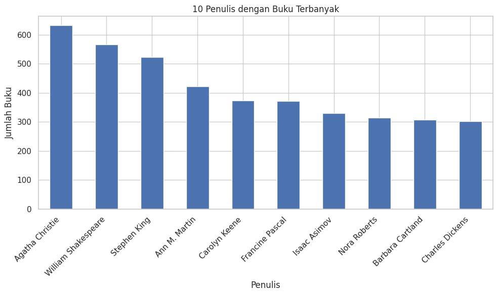
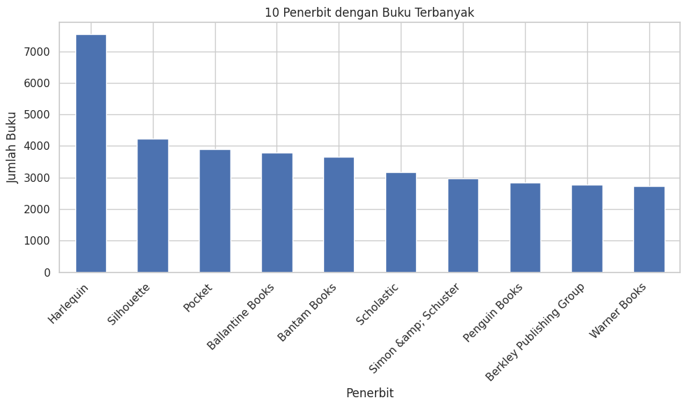
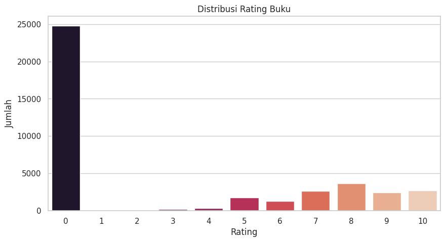
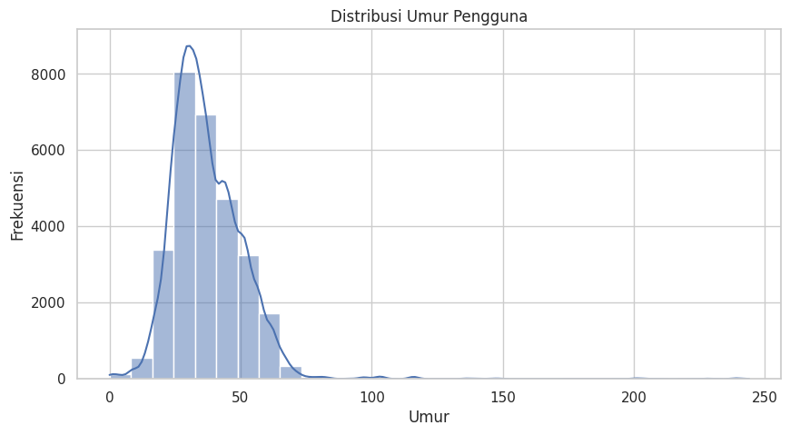
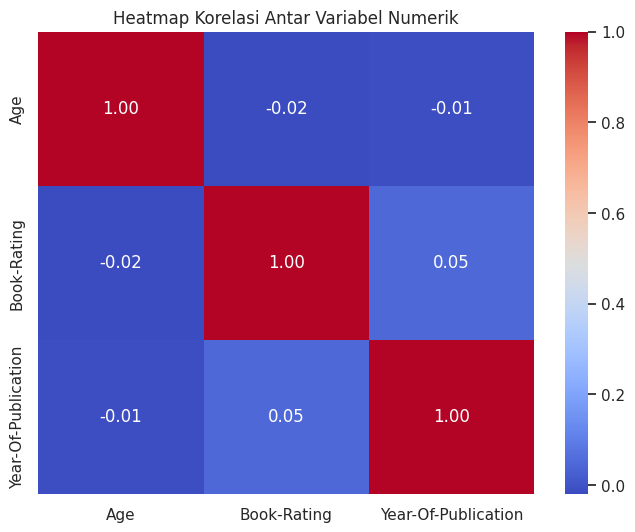

# Laporan Proyek Machine Learning - Putri Indah Sari

# Book Recommendation

## Project Overview

**Latar Belakang Proyek**

Di era digital saat ini, industri penerbitan buku mengalami transformasi besar-besaran. Ledakan platform e-commerce seperti Amazon, perpustakaan digital, dan situs ulasan buku seperti Goodreads telah membuka akses ke jutaan judul buku dari seluruh dunia. Jika sebelumnya penemuan buku baru terbatas pada rekomendasi dari teman atau kunjungan ke toko buku fisik, kini pembaca dihadapkan pada lautan pilihan yang sangat luas secara online.

Namun, kemudahan ini juga melahirkan tantangan baru yang dikenal sebagai **paradoks pilihan** (Schwartz, 2004). Ketika terlalu banyak opsi tersedia, pengguna sering merasa kewalahan dan mengalami kesulitan dalam membuat keputusan. Hal ini dapat menurunkan pengalaman pengguna dan menghambat eksplorasi konten baru.

Di sisi lain, **sistem rekomendasi** telah terbukti menjadi alat yang sangat efektif dalam membantu pengguna menavigasi informasi yang melimpah. Menurut Adomavicius & Tuzhilin (2005), sistem rekomendasi berperan penting dalam meningkatkan kepuasan pengguna dengan menyajikan pilihan yang lebih personal. Bahkan, studi Gomez-Uribe & Hunt (2015) menunjukkan bahwa penerapan sistem rekomendasi di platform contohnya seperti Netflix berkontribusi pada peningkatan retensi pelanggan sebesar 75%.

Dengan mengombinasikan data interaksi pengguna, atribut konten buku, dan algoritma _machine learning_, sistem rekomendasi memungkinkan personalisasi yang lebih dalam dan relevan. Selain itu, sistem ini juga membantu mendorong penemuan konten baru (_serendipity_) dan diversifikasi konsumsi, sehingga dapat mengurangi bias popularitas (Cremonesi et al., 2010).

Dalam proyek ini, data buku diidentifikasi berdasarkan ISBN. ISBN yang tidak valid telah dihapus. Metadata yang tersedia meliputi: judul, penulis, tahun terbit, penerbit, dan URL sampul buku yang bersumber dari Amazon Web Services. Oleh karena itu, tujuan dari proyek ini adalah merancang dan mengimplementasikan model sistem rekomendasi buku yang mampu memberikan rekomendasi akurat dan personal, serta berkontribusi dalam mengatasi tantangan penemuan konten di era digital.

**Referensi**

1. Adomavicius, G., & Tuzhilin, A. (2005). Toward the next generation of recommender systems: A survey of the state-of-the-art and possible extensions. _IEEE Transactions on Knowledge and Data Engineering, 17(6)_, 734–749. [https://doi.org/10.1109/TKDE.2005.99](https://doi.org/10.1109/TKDE.2005.99)
2. Cremonesi, P., Koren, Y., & Turrin, R. (2010). Performance of recommender algorithms on top-N recommendation tasks. _Proceedings of the Fourth ACM Conference on Recommender Systems_, 39–46. [https://doi.org/10.1145/1864708.1864721](https://doi.org/10.1145/1864708.1864721)
3. Gomez-Uribe, C. A., & Hunt, N. (2015). The Netflix recommender system: Algorithms, business value, and innovation. _ACM Transactions on Management Information Systems, 6(4)_, 1–19. [https://doi.org/10.1145/2843948](https://doi.org/10.1145/2843948)
4. Schwartz, B. (2004). _The paradox of choice: Why more is less_. Harper Perennial.
5. Ardiansyah, R., Bianto, M. A., & Saputra, B. D. (2023). Sistem Rekomendasi Buku Perpustakaan Sekolah menggunakan Metode Content-Based Filtering. Jurnal CoSciTech (Computer Science and Information Technology), 4(2), 510-518.
6. Supoyo, B., Mamangkey, X. F. A., Mengko, R. M., Wijaya, I. M. H., Tarigan, V., & Yusupa, A. (2025). Implementasi Sistem E-Book Rekomendasi Berbasis Web Sederhana Menggunakan Content-Based Filtering. Applied Information Technology and Computer Science (AICOMS), 4(1), 15-24.
7. Ridhwanullah, D., Kumarahadi, Y. K., & Raharja, B. D. (2024). Content-Based Filtering pada Sistem Rekomendasi Buku Informatika. Jurnal Ilmiah SINUS, 22(2), 57-66.

---

## Business Understanding

### Problem Statements

1. Di tengah jutaan buku yang tersedia di platform digital, bagaimana pengguna dapat menemukan buku baru yang benar-benar sesuai dengan selera unik mereka tanpa merasa kebingungan atau menghabiskan waktu terlalu banyak untuk mencari?
2. Bagaimana sebuah platform dapat meningkatkan interaksi dan loyalitas pengguna dengan menyajikan konten yang relevan secara personal, sekaligus mengatasi bias popularitas (cenderung hanya merekomendasikan buku yang sudah terkenal) untuk menampilkan koleksi buku yang lebih beragam?
3. Bagaimana data interaksi pengguna (rating) dan data atribut buku (penulis, penerbit, genre) dapat dimanfaatkan secara efektif untuk membangun model prediksi preferensi yang akurat dan dapat memberikan rekomendasi yang relevan?

### Goals

1. Membangun sebuah sistem rekomendasi yang mampu menghasilkan daftar **Top-N** rekomendasi buku yang dipersonalisasi untuk setiap pengguna berdasarkan riwayat dan preferensi mereka.
2. Mengembangkan dan mengimplementasikan dua jenis model rekomendasi, yaitu **Content-Based Filtering** dan **Collaborative Filtering**, untuk membandingkan pendekatan serta kelebihan dan kekurangan dari masing-masing metode.
3. Melakukan evaluasi terhadap kinerja kedua model menggunakan metrik yang sesuai (seperti _Precision@k_(sistem rekomendasi terutama untuk tugas top-N recommendation, di mana model menyarankan k item teratas kepada pengguna)) untuk mengukur tingkat relevansi dan akurasi dari rekomendasi yang diberikan.

### Solution statements

1.  **Melakukan Persiapan Data:** Membersihkan dan mempersiapkan dataset `book_df` dan `user_rating_df`. Termasuk menangani nilai yang hilang (missing values), melakukan eksplorasi data (EDA) untuk memahami distribusi dan pola data, serta melakukan filtering untuk mengurangi noise pada data rating.

2.  **Mengembangkan Model Content-Based Filtering:**

    - Input: Dataset `book_df`.
    - Proses: Menggunakan fitur-fitur buku seperti `Book-Author` dan `Publisher`. Fitur teks ini akan diubah menjadi representasi numerik (vektor) menggunakan teknik TF-IDF Vectorizer. Selanjutnya, tingkat kemiripan antar buku akan dihitung menggunakan Cosine Similarity.
    - Output: Sebuah fungsi yang menerima judul buku dan memberikan rekomendasi buku lain yang paling mirip berdasarkan kontennya.

3.  **Mengembangkan Model Collaborative Filtering:**
    - Input: Dataset `user_rating_df`.
    - Proses: Membangun matriks interaksi pengguna-item (user-item interaction matrix) dari data `User-ID`, `ISBN`, dan `Book-Rating`. Algoritma seperti Singular Value Decomposition (SVD) akan diimplementasikan untuk memprediksi rating yang mungkin diberikan pengguna pada buku yang belum ia baca.
    - Output: Sebuah fungsi yang menerima ID pengguna dan memberikan rekomendasi buku yang diprediksi akan paling ia sukai.
4.  **Evaluasi dan Penarikan Kesimpulan:** Hasil dari kedua model akan dievaluasi performanya untuk membandingkan pendekatan mana yang lebih efektif dalam memberikan rekomendasi yang relevan pada konteks dataset ini.

---

## Data Understanding

**Dataset:** [Book Recomendation Dataset](https://www.kaggle.com/code/fahadmehfoooz/book-recommendation-system)

- Dua file utama yang akan digunakan:

  - `Books.csv` : Berisi metadata buku (ISBN, Book-Title, Book-Author, Year-Of-Publication, Publisher, Image-URL-S, Image-URL-M, Image-URL-L).
  - `user_rating` : Hasil merge `Ratings.csv dan Users.csv` yang berisi (User-ID, ISBN, Book-Rating, Location, Age).

- Jumlah data:

  - book_df: 271.360 baris data buku, tidak ada missing value yang signifikan,hanya book_author,publisher,dan image url.
  - ratings_df: 40.000 baris data rating (sampel), tidak ada missing value.
  - user_df: 278.858 baris data pengguna, ada missing value pada kolom Age (sekitar 39% data tidak memiliki nilai Age).
  - user_rating_df: 40.000 baris data rating yang digabungkan dengan data pengguna, ada missing value pada kolom Age (sekitar 27% data tidak memiliki nilai Age).

- Variabel / Fitur
  Variabel-variabel pada Book Recommendation dataset adalah sebagai berikut:

1. Books.csv:

- ISBN: Nomor identifikasi buku ,tipe data: object
- Book-Title: Judul buku ,tipe data: object
- Book-Author: Penulis buku ,tipe data: object
- Year-Of-Publication: Tahun publikasi ,tipe data: object
- Publisher: Penerbit ,tipe data: object
- Image-URL-S/M/L: URL gambar buku (ukuran kecil, sedang, besar) ,tipe data: object

2. Ratings.csv:

- User-ID: ID pengguna ,tipe data: int64
- ISBN: Nomor identifikasi buku ,tipe data: object
- Book-Rating: Rating buku (0-10) ,tipe data: int64

3. Users.csv:

- User-ID: ID pengguna, tipe data: int64
- Location: Lokasi pengguna, tipe data: object
- Age: Usia pengguna, tipe data: float64

#### Detail fitur dalam tabel

## 📚 Deskripsi Rinci Dataset: Book-Crossings Dataset

Dataset ini terdiri dari tiga file utama: `Books.csv`, `Users.csv`, dan `Ratings.csv`. Berikut adalah rincian isi dan informasi missing values pada masing-masing file berdasarkan data mentah awal.

---

### 1. `Books.csv`

Berisi metadata informasi buku.
Jumlah Baris: 271.360
Jumlah Kolom: 8

| Kolom                 | Tipe Data | Deskripsi                                       | Missing |
| --------------------- | --------- | ----------------------------------------------- | ------- |
| `ISBN`                | object    | ID unik internasional untuk buku (Primary Key). | 0       |
| `Book-Title`          | object    | Judul lengkap dari buku.                        | 0       |
| `Book-Author`         | object    | Nama penulis buku.                              | 2       |
| `Year-Of-Publication` | object    | Tahun ketika buku pertama kali diterbitkan.     | 0       |
| `Publisher`           | object    | Nama perusahaan penerbit buku.                  | 2       |
| `Image-URL-S`         | object    | URL gambar sampul ukuran kecil (Small).         | 0       |
| `Image-URL-M`         | object    | URL gambar sampul ukuran sedang (Medium).       | 0       |
| `Image-URL-L`         | object    | URL gambar sampul ukuran besar (Large).         | 3       |

Duplikat: Tidak ditemukan duplikat.
Outlier: Ditemukan data tahun publikasi di luar rentang 1900-2025, telah dihapus.

---

### 2. `Users.csv`

Berisi informasi pengguna.
Jumlah Baris: 278.858
Jumlah Kolom: 3
| Kolom | Tipe Data | Deskripsi | Missing |
| ---------- | --------- | -------------------------------------------- | ------- |
| `User-ID` | int64 | ID unik untuk setiap pengguna (Primary Key). | 0 |
| `Location` | object | Lokasi pengguna (Kota, Provinsi, Negara). | 0 |
| `Age` | float64 | Usia pengguna dalam tahun. | 10.724 |

Duplikat: Tidak ditemukan duplikat.
Outlier: Ditemukan data usia < 5 tahun atau > 100 tahun, telah dihapus.

---

### 3. `Ratings.csv`

Berisi data interaksi antara pengguna dan buku dalam bentuk rating.

**Jumlah Baris:** 40.000
| Kolom | Tipe Data | Deskripsi | Missing |
| ------------- | --------- | ----------------------------------------------------- | ------- |
| `User-ID` | int64 | ID pengguna yang memberi rating (Foreign Key). | 0 |
| `ISBN` | object | ID buku yang diberi rating (Foreign Key). | 0 |
| `Book-Rating` | int64 | Skor rating (1–10 untuk eksplisit, 0 untuk implisit). | 0 |

---

### EDA (Exploratory Data Analysis)

Untuk memahami karakteristik data sebelum diterapkan ke model rekomendasi, dilakukan eksplorasi data visual dan statistik sebagai berikut:

#### 10 Penulis dengan Buku Terbanyak



- Dominasi penulis fiksi populer (Agatha Christie, Stephen King)
- Kesenjangan besar antara penulis paling produktif dengan lainnya
- Dapat digunakan untuk content-based filtering berdasarkan penulis

#### 10 Penerbit dengan Buku Terbanyak



- Top 10 Penerbit" didominasi oleh penerbit-penerbit besar yang terkenal dengan buku fiksi pasar massal seperti Harlequin, Silhouette, dan Pocket.
  insightnya: menunjukkan bahwa dataset tidak merata,ykni memiliki bias yang kuat ke arah fiksi populer berbahasa Inggris

### Distribusi Rating Buku

- Rata-rata rating buku: **2.87**
- Nilai rating `0` mendominasi → dianggap sebagai **rating implisit**.
- Insight: Distribusi ini menunjukkan bahwa banyak pengguna hanya berinteraksi tanpa memberi skor eksplisit.



- Rating 0 mendominasi (mungkin mewakili interaksi implisit)
- Rating aktual (1-10) menunjukkan distribusi yang tidak merata
- Rating tinggi (8-10) relatif jarang dibanding rating menengah (5-7)
- Distribusi ini menunjukkan bias positif yang perlu dipertimbangkan dalam modeling

### Distribusi Umur Pengguna



- Mayoritas pengguna berusia 20-50 tahun
- Terdapat outlier usia <5 tahun dan >100 tahun yang perlu dibersihkan
- Puncak distribusi di usia 30-an menunjukkan demografi utama platform

#### Statistik Interaksi

- Rata-rata rating per pengguna: sekitar **8.26**
- Rata-rata rating per buku: hanya **1.33**
  > Menunjukkan bahwa sebagian besar buku hanya mendapat satu atau dua rating saja (data sangat sparse).

#### Korelasi Antar Variabel

Menggunakan heatmap dari kolom numerik:

| Variabel            | Korelasi |
| ------------------- | -------- |
| Age vs Book-Rating  | -0.01    |
| Age vs Year         | -0.02    |
| Book-Rating vs Year | 0.04     |

**Insight:**

- Umur pengguna tidak terlalu memengaruhi rating.
- Buku lama maupun baru memiliki rating yang relatif sama.
- Korelasi antar variabel numerik sangat lemah (mendekati 0).
  
- Tidak ada hubungan linear yang signifikan antara umur pengguna, rating yang mereka berikan, dan tahun terbit buku.
- Age vs Book-Rating: -0.01 : Umur pengguna tidak menentukan apakah mereka akan memberi rating tinggi atau rendah. Pengguna muda, dewasa, maupun yang lebih tua memiliki kecenderungan rating yang serupa.
- Age vs Year-Of-Publication: -0.02: Tidak ada tren yang menunjukkan bahwa pengguna dari kelompok umur tertentu lebih menyukai buku-buku dari era tertentu (misalnya, pengguna muda tidak secara signifikan lebih banyak membaca buku baru).
- Book-Rating vs Year-Of-Publication: 0.04: Buku-buku baru tidak secara otomatis mendapatkan rating yang lebih tinggi dibandingkan buku-buku yang lebih tua, dan sebaliknya.

### Kesimpulan EDA:

- Dataset mengandung **sparse rating** dan **missing value pada usia** yang perlu ditangani.
- Distribusi umur dan tahun publikasi perlu dibersihkan.
- Pendekatan sistem rekomendasi harus mempertimbangkan banyaknya interaksi implisit.
- Tidak ada indikasi kuat bahwa variabel umur atau tahun terbit berkorelasi signifikan terhadap rating.

---

## Data Preparation

### 1. Handling Missing Values (All Data)

- Jumlah baris book_df sebelum dibersihkan: 271357
- Mengubah 'Year-Of-Publication' ke numerik, error menjadi NaN
- memfilter tahun yang valid (1900 - 2025) dan hapus NaN
- Jumlah baris book_df setelah dibersihkan: 266723
- Kolom age data yang kosong dihapus (baris dengan NaN pada kolom Age dihapus). Setelah itu, dilakukan pembersihan outlier, yaitu usia di luar rentang 5 hingga 100 tahun.
- Kolom `Image-URL-L` yang kosong tidak diproses lebih lanjut, karena tidak dipakai untuk pemodelan.

### 2. Content-Based Filtering Preprocessing

#### 2.1 Merge dan Pembuatan Fitur

- Kolom `Book-Author` dan `Publisher` yang kosong diisi string `"Unknown_Author"` dan `"Unknown_Publisher"` untuk menjaga kelengkapan data buku.
- Gabungkan fitur penulis dan penerbit menjadi satu kolom 'features' dan menyimpan data yang siap pakai untuk model ini `book_content_df = book_df.copy()`.
- Dibuat kolom baru `features` dengan menggabungkan `Book-Author` dan `Publisher` untuk membangun representasi konten.
- Data buku difilter agar hanya mencakup ISBN populer yang muncul di collaborative_df, menjadi `content_filtered_df`.

#### 2.2 TF-IDF Vectorization

- Kolom `features` diubah menjadi vektor numerik menggunakan **TF-IDF Vectorizer**:

```math
TFIDF(t,d) = TF(t,d) \times \log\left(\frac{N}{DF(t)}\right)
```

Dimana:

- `TF(t,d)` = Frekuensi kata `t` dalam dokumen `d`

- `N` = Total jumlah dokumen (buku)

- `DF(t)` = Jumlah dokumen yang mengandung kata `t`

- Implementasi:

```python
tfidf = TfidfVectorizer()
tfidf_matrix_filtered = tfidf.fit_transform(content_filtered_df['features'])
```

- Hasil:
  Matriks sparse `[jumlah buku populer x jumlah fitur unik]` (\~266k × 54k) → digunakan sebagai input model Content-Based Filtering.

### 3. Collaborative Filtering Preprocessing

#### 3.1 Merge dan Filtering Data

- Dataset `Ratings.csv` digabung dengan `Users.csv` → membentuk `user_rating_df`.
- Memisahkan Rating Eksplisit dengan membuat dataframe baru, menggunakan rating yang jelas (1-10) untuk mengetahui preferensi pengguna.
- Cek Distribusi Rating untuk menentukan angka threshold dengan pengguna yang paling aktif
- Data difilter:

  - Pengguna dengan rating terbanyak (active users).
  - Buku dengan jumlah rating yang mencukupi (popular items).

- Hasil akhir disimpan dalam `collaborative_df` — data padat untuk Collaborative Filtering.

#### 3.2 Pembuatan Data Surprise

- Dataset `collaborative_df` dikonversi ke format yang bisa diproses oleh library `surprise`:

```python
reader = Reader(rating_scale=(1, 10))
data = Dataset.load_from_df(collaborative_df[['User-ID', 'ISBN', 'Book-Rating']], reader)
trainset = data.build_full_trainset()
```

- Trainset ini digunakan untuk melatih model SVD.

### Summary Tahapan Data Preparation:

| Tahapan                                 | Output Data                              |
| --------------------------------------- | ---------------------------------------- |
| Handling Missing Values                 | `book_df`, `user_rating_df`              |
| Merge & Feature Engineering (CBF)       | `book_content_df`, `content_filtered_df` |
| TF-IDF Vectorization (CBF)              | `tfidf_matrix_filtered`                  |
| Merge & Filtering (Collaborative)       | `collaborative_df`                       |
| Pembuatan data Surprise (Collaborative) | `trainset` untuk SVD                     |

---

# Modeling

## Content-Based Filtering

Content-Based Filtering sistem memanfaatkan informasi atribut buku seperti **Book-Author** dan **Publisher**.  
Dengan menggunakan teknik **TF-IDF Vectorization** dan **Cosine Similarity**, model menghitung tingkat kemiripan antar buku.

#### 1. Cosine Similarity

Buku yang memiliki karakteristik konten yang mirip dengan buku yang disukai pengguna akan direkomendasikan.
  - similarity(A, B) = (A • B) / (||A|| × ||B||)
    
(_Cosine Similarity antara dua vektor fitur buku_)setiap buku direpresentasikan sebagai vektor TF-IDF yang dibangun dari kombinasi fitur Book-Author dan Publisher.Vektor ini representasi numerik dari teks, sehingga buku yang memiliki penulis atau penerbit yang mirip akan memiliki vektor yang cenderung serupa.

Cosine similarity akan menghitung sudut antara dua vektor TF-IDF tersebut:

- Nilai similarity = 1 → vektor identik → buku sangat mirip
- Nilai similarity = 0 → vektor ortogonal → buku tidak mirip sama sekali

Setelah vektor TF-IDF terbentuk, fungsi rekomendasi dibuat untuk mencari buku yang paling mirip dengan judul buku input berdasarkan nilai cosine similarity tertinggi.

**Contoh hasil Top-5 rekomendasi untuk buku "Love You Forever":**

| Judul Buku                                        | Penulis      | Skor Kemiripan |
| ------------------------------------------------- | ------------ | -------------- |
| The Street Lawyer                                 | John Grisham | 0.0577         |
| Key of Knowledge (Key Trilogy (Paperback))        | Nora Roberts | 0.0544         |
| Key of Light (Key Trilogy (Paperback))            | Nora Roberts | 0.0544         |
| Dance upon the Air (Three Sisters Island Trilogy) | Nora Roberts | 0.0544         |
| The Angel of Darkness                             | Caleb Carr   | 0.0521         |

**Insight:**

- Model berhasil memberikan rekomendasi yang relevan di genre **fiksi dewasa dan relasi emosional**.
- Pemilihan penulis populer seperti Nora Roberts dan John Grisham menunjukkan bahwa model juga menangkap **popularitas penulis**.
- Skor kemiripan relatif rendah (~0.05), yang mengindikasikan bahwa **fitur konten** yang digunakan (author + publisher) masih dapat dikembangkan lebih lanjut (misalnya dengan menambah genre, sinopsis, atau deskripsi buku).

---

## Collaborative Filtering (SVD)

Collaborative Filtering memanfaatkan **pola interaksi antar pengguna** untuk memprediksi preferensi.  
Model yang digunakan adalah **Singular Value Decomposition (SVD)** mempelajari pola dari rating yang diberikan oleh berbagai pengguna,lalu model dapat memprediksi rating yang mungkin diberikan oleh pengguna ke buku yang belum mereka baca.

**Rumus utama:**

$$
R_{ui} = \mu + b_u + b_i + q_i^T p_u
$$

Dimana:

- \( \mu \) = rata-rata global rating
- \( b_u \) = bias user
- \( b_i \) = bias item (buku)
- \( q_i \), \( p_u \) = vektor faktor laten item dan user

---

**Contoh hasil Top-3 rekomendasi untuk User-ID 223787:**
| Judul Buku | Penulis | Predicted Rating |
| ----------------------------------------------------- | ----------------------- | ---------------- |
| To Kill a Mockingbird | Harper Lee | 8.74 |
| Harry Potter and the Order of the Phoenix (Book 5) | J. K. Rowling | 8.72 |
| Adventures of Sherlock Holmes (Wordsworth Collection) | Arthur Conan, Sir Doyle | 8.63 |

**Insight:**

- Model berhasil merekomendasikan buku-buku yang sangat populer dari berbagai genre klasik dan fiksi populer.
- Ini menunjukkan bahwa Collaborative Filtering SVD mampu menangkap preferensi pengguna berdasarkan pola rating pengguna lain yang memiliki kesamaan minat.
- Rekomendasi mencerminkan kemampuan model untuk menghadirkan buku lintas genre, bukan hanya berdasarkan konten, melainkan berdasarkan pola rating pengguna-pengguna serupa (serendipity).
- Predicted Rating tinggi (di atas 8.6) menunjukkan bahwa model cukup yakin pengguna ini akan menyukai buku-buku yang direkomendasikan.

## Model Collaborative Filtering (SVD):

Hasil evaluasi dengan 5-Fold Cross Validation:

| Metrik      | Nilai  |
| ----------- | ------ |
| RMSE        | 1.8524 |
| MAE         | 1.4245 |
| Precision@5 | 0.0600 |

---

## Perbandingan Kedua Model

| Aspek             | Content-Based Filtering          | Collaborative Filtering (SVD)              |
| ----------------- | -------------------------------- | ------------------------------------------ |
| Basis rekomendasi | Atribut buku (penulis, penerbit) | Pola rating antar pengguna                 |
| Tipe rekomendasi  | Spesifik, mirip konten           | Beragam, eksploratif                       |
| Metode evaluasi   | Precision@5                      | RMSE, MAE, Precision@5                     |
| Precision@5       | 0.0600                           | 0.2194                                     |
| Kelebihan         | Aman dan transparan              | Serendipity dan penemuan baru              |
| Kekurangan        | Cenderung sempit dan berulang    | Cold-start & sensitif terhadap data sparse |

---

## Kesimpulan Komparatif

- **Content-Based Filtering** unggul dalam memberikan rekomendasi yang relevan dan aman bagi pengguna yang ingin eksplorasi lebih lanjut dari minat yang sudah ada.
- **Collaborative Filtering (SVD)** unggul dalam menemukan koneksi dan minat baru yang tidak terduga, memberikan efek serendipity yang penting dalam meningkatkan kepuasan pengguna.
- Dalam aplikasi nyata, kombinasi hybrid dari keduanya akan menghasilkan sistem rekomendasi yang lebih optimal.

## Penyimpanan Model dan Data

Model terbaik (SVD) disimpan dalam file:

```python
'svd_model.pkl'
```

---

# Evaluation

### Evaluasi Model Rekomendasi

Evaluasi dilakukan terhadap kedua model yang telah dibangun, yaitu **Content-Based Filtering** dan **Collaborative Filtering (SVD)**, dengan menggunakan metrik evaluasi yang sesuai untuk sistem rekomendasi, yakni **Precision\@5**, **RMSE**, dan **MAE**.

### Content-Based Filtering

Evaluasi dilakukan dengan menghitung **Precision\@5**,

$$
\text{Precision@5} = \frac{\text{Jumlah item relevan di Top-5}}{5}
$$

- \frac{} = pecahan, formula fraction (pembilang dibagi penyebut)

- Precision@5 = berapa persen item yang relevan di antara Top 5 yang kamu rekomendasikan

yakni menggunakan metode cosine similarity terhadap vektor TF-IDF dari fitur gabungan `Book-Author` dan `Publisher`. Sebanyak 20 buku dipilih secara acak untuk diuji, dan untuk setiap buku, diambil 5 buku teratas sebagai rekomendasi. Relevansi ditentukan berdasarkan kesamaan penulis.

**Hasil:**

- **Precision\@5:** `0.0600`

**Interpretasi:**

- Nilai Precision\@5 tergolong rendah, menunjukkan bahwa pendekatan content-based sederhana ini belum cukup baik dalam memberikan rekomendasi yang benar-benar relevan bagi pengguna.
- Penyebab utama adalah keterbatasan fitur konten yang digunakan (hanya `Book-Author` dan `Publisher`) tanpa memperhitungkan genre, sinopsis, atau konten semantik lainnya.

---

### Collaborative Filtering (SVD)

Model SVD dievaluasi menggunakan:

1. **Root Mean Squared Error (RMSE)**
   Mengukur deviasi rata-rata kuadrat antara prediksi dan nilai aktual. Semakin kecil, semakin akurat.

2. **Mean Absolute Error (MAE)**
   Mengukur rata-rata kesalahan absolut antara prediksi dan nilai aktual. Lebih tahan terhadap outlier dibanding RMSE.

3. **Precision\@5**
   Untuk mengukur relevansi dalam konteks top-N recommendation. Sistem memeriksa apakah prediksi rating ≥ 7 pada 5 rekomendasi teratas untuk setiap pengguna.

**Hasil Evaluasi (5-Fold Cross-Validation):**

| Metrik       | Nilai  |
| ------------ | ------ |
| RMSE         | 1.6825 |
| MAE          | 1.3144 |
| Precision\@5 | 0.2000 |

**Interpretasi:**

- Model **Collaborative Filtering (SVD)** menghasilkan nilai RMSE dan MAE yang relatif rendah, menunjukkan bahwa prediksi rating yang dihasilkan cukup akurat dan mendekati nilai aktual yang diberikan pengguna.
- **Precision\@5** yang cukup baik (20.00%) menunjukkan bahwa sekitar 1 dari 5 rekomendasi teratas dianggap relevan — performa yang jauh lebih baik dibanding Content-Based Filtering.

**hasil dengan Business Understanding**

- **Problem Statement**: membantu pengguna menemukan buku yang sesuai dengan preferensi unik mereka, mengurangi paradox of choice, dan meningkatkan engagement.
- **Hasil evaluasi model Collaborative Filtering** menunjukkan bahwa model ini:

  - Mampu menangkap preferensi pengguna secara personal → **menjawab problem statement 1**.
  - Menghadirkan rekomendasi lintas genre → mengurangi bias popularitas → **menjawab problem statement 2**.
  - Mampu meningkatkan relevansi dan engagement → **mendukung goal bisnis platform**.

### Kesimpulan Evaluasi

- **Content-Based Filtering** menghasilkan Precision\@5 yang rendah, kemungkinan besar karena keterbatasan fitur (hanya penulis dan penerbit).
- **Collaborative Filtering (SVD)** unggul baik dalam akurasi prediksi (RMSE/MAE) maupun relevansi rekomendasi (Precision\@5).
- Oleh karena itu, **Collaborative Filtering dinilai sebagai model terbaik** dalam proyek ini, untuk digunakan sebagai dasar sistem rekomendasi.

### Deployment

Model terbaik (Collaborative Filtering - SVD) disimpan dalam format `.pkl` menggunakan modul `pickle`. File ini memungkinkan model untuk dimuat kembali di masa depan tanpa perlu pelatihan ulang.

```python
with open('best_model.pkl', 'wb') as f:
    pickle.dump(svd, f)
```

### Rekomendasi Pengembangan Selanjutnya

- Tambahkan fitur konten yang lebih kaya seperti judul, genre, atau sinopsis untuk memperkuat representasi buku pada content-based filtering.
- Gunakan Precision\@k juga pada collaborative filtering agar evaluasi relevansi antar pendekatan lebih setara.
- Terapkan pendekatan Hybrid Filtering yang menggabungkan kekuatan content-based dan collaborative filtering.
- Perluas ukuran sampel evaluasi jika memungkinkan untuk hasil metrik yang lebih representatif.
